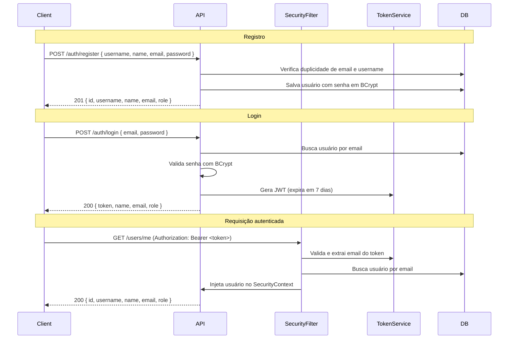

# Autenticação — Flowia API

Documentação da feature de autenticação e autorização da Flowia API, implementada com **Spring Security** e **JWT (JSON Web Token)**.

---

## Sumário

- [Visão Geral](#visão-geral)
- [Stack Utilizada](#stack-utilizada)
- [Endpoints](#endpoints)
  - [POST /auth/register](#post-authregister)
  - [POST /auth/login](#post-authlogin)
  - [GET /users/me](#get-usersme)
- [DTOs](#dtos)
- [Modelo de Usuário](#modelo-de-usuário)
- [Roles](#roles)
- [Fluxo de Autenticação](#fluxo-de-autenticação)
- [Segurança](#segurança)
- [Tratamento de Erros](#tratamento-de-erros)

---

## Visão Geral

A autenticação da Flowia API é **stateless**, baseada em tokens JWT. Não há sessão no servidor — cada requisição protegida deve incluir o token no header `Authorization`.

```
POST /auth/register  →  cria uma conta
POST /auth/login     →  autentica e retorna um token JWT
GET  /users/me       →  retorna os dados do usuário autenticado (requer token)
```

---

## Stack Utilizada

| Tecnologia | Uso |
|---|---|
| Spring Security | Filtros, autenticação e autorização |
| JWT (auth0/java-jwt) | Geração e validação de tokens |
| BCrypt | Hash de senhas |
| Jakarta Validation | Validação dos campos de entrada |
| JPA / Hibernate | Persistência do usuário |

---

## Endpoints

### POST /auth/register

Cria um novo usuário com role `USER`.

**Acesso:** público

#### Request Body

```json
{
  "username": "rianlucas",
  "name": "Rian Lucas",
  "email": "rian@email.com",
  "password": "senha123"
}
```

| Campo | Tipo | Validação |
|---|---|---|
| `username` | `string` | Obrigatório, entre 3 e 50 caracteres |
| `name` | `string` | Obrigatório |
| `email` | `string` | Obrigatório, formato de e-mail válido |
| `password` | `string` | Obrigatório, mínimo 6 caracteres |

#### Response — `201 Created`

```json
{
  "id": "550e8400-e29b-41d4-a716-446655440000",
  "username": "rianlucas",
  "name": "Rian Lucas",
  "email": "rian@email.com",
  "role": "USER"
}
```

#### Possíveis Erros

| Status | Cenário |
|---|---|
| `400 Bad Request` | Campos inválidos ou ausentes |
| `409 Conflict` | E-mail ou username já cadastrado |

---

### POST /auth/login

Autentica o usuário e retorna um token JWT.

**Acesso:** público

#### Request Body

```json
{
  "email": "rian@email.com",
  "password": "senha123"
}
```

| Campo | Tipo | Validação |
|---|---|---|
| `email` | `string` | Obrigatório, formato de e-mail válido |
| `password` | `string` | Obrigatório |

#### Response — `200 OK`

```json
{
  "token": "eyJhbGciOiJIUzI1NiIsInR5cCI6IkpXVCJ9...",
  "name": "Rian Lucas",
  "email": "rian@email.com",
  "role": "USER"
}
```

O token tem validade de **7 dias**.

#### Possíveis Erros

| Status | Cenário |
|---|---|
| `400 Bad Request` | Campos inválidos ou ausentes |
| `401 Unauthorized` | E-mail ou senha incorretos |
| `403 Forbidden` | Conta bloqueada ou desativada |

---

### GET /users/me

Retorna os dados do usuário autenticado com base no token JWT.

**Acesso:** requer autenticação

#### Headers

```
Authorization: Bearer <token>
```

#### Response — `200 OK`

```json
{
  "id": "550e8400-e29b-41d4-a716-446655440000",
  "username": "rianlucas",
  "name": "Rian Lucas",
  "email": "rian@email.com",
  "role": "USER"
}
```

#### Possíveis Erros

| Status | Cenário |
|---|---|
| `401 Unauthorized` | Token ausente, inválido ou expirado |
| `403 Forbidden` | Acesso negado |

---

## DTOs

### `RegisterRequestDTO`

```
username  — string, 3–50 chars, único
name      — string
email     — string, formato e-mail, único
password  — string, mínimo 6 chars
```

### `LoginRequestDTO`

```
email     — string, formato e-mail
password  — string
```

### `AuthResponseDTO`

```
token     — string (JWT)
name      — string
email     — string
role      — UserRole (USER | ADMIN)
```

### `UserResponseDTO`

```
id        — string (UUID)
username  — string
name      — string
email     — string
role      — UserRole (USER | ADMIN)
```

---

## Modelo de Usuário

A entidade `User` implementa `UserDetails` do Spring Security e é mapeada para a tabela `users`.

| Campo | Tipo | Constraints |
|---|---|---|
| `id` | `String` (UUID) | PK, gerado automaticamente |
| `email` | `String` | Único, não nulo |
| `password` | `String` | Não nulo (armazenado como hash BCrypt) |
| `username` | `String` | Único, não nulo |
| `name` | `String` | Não nulo |
| `role` | `UserRole` | Enum, não nulo |

---

## Roles

| Role | Authorities concedidas |
|---|---|
| `USER` | `ROLE_USER` |
| `ADMIN` | `ROLE_ADMIN`, `ROLE_USER` |

Por padrão, todo usuário registrado via `/auth/register` recebe a role `USER`.

---

## Fluxo de Autenticação



---

## Segurança

### JWT

- **Algoritmo:** HMAC256
- **Issuer:** `flowia-api`
- **Subject:** e-mail do usuário
- **Claims extras:** `name`, `role`
- **Expiração:** 7 dias (UTC-3)
- **Secret:** configurado via `application.properties` → `api.security.token.secret`

### SecurityFilter

O filtro `SecurityFilter` (`OncePerRequestFilter`) intercepta todas as requisições e:

1. Ignora requisições `OPTIONS` (preflight CORS).
2. Extrai o token do header `Authorization: Bearer <token>`.
3. Valida o token via `TokenService`.
4. Busca o usuário no banco pelo e-mail extraído do token.
5. Registra a autenticação no `SecurityContextHolder`.

### Rotas públicas

| Método | Rota |
|---|---|
| `POST` | `/auth/login` |
| `POST` | `/auth/register` |

Todas as demais rotas exigem autenticação.

---

## Tratamento de Erros

Gerenciado globalmente pelo `GlobalExceptionHandler` (`@RestControllerAdvice`).

| Exceção | Status HTTP | Mensagem |
|---|---|---|
| `EmailAlreadyExistsException` | `409 Conflict` | `"Email already in use: <email>"` |
| `UsernameAlreadyExistsException` | `409 Conflict` | `"Username already in use: <username>"` |
| `BadCredentialsException` | `401 Unauthorized` | `"Invalid email or password"` |
| `LockedException` | `403 Forbidden` | `"Account is locked"` |
| `DisabledException` | `403 Forbidden` | `"Account is disabled"` |
| `MethodArgumentNotValidException` | `400 Bad Request` | Mapa de erros por campo |
| `Exception` (genérica) | `500 Internal Server Error` | `"An unexpected error occurred"` |

### Exemplo de erro de validação (`400`)

```json
{
  "email": "Invalid email format",
  "password": "Password must be at least 6 characters"
}
```

### Exemplo de erro de conflito (`409`)

```json
{
  "error": "Email already in use: rian@email.com"
}
```
