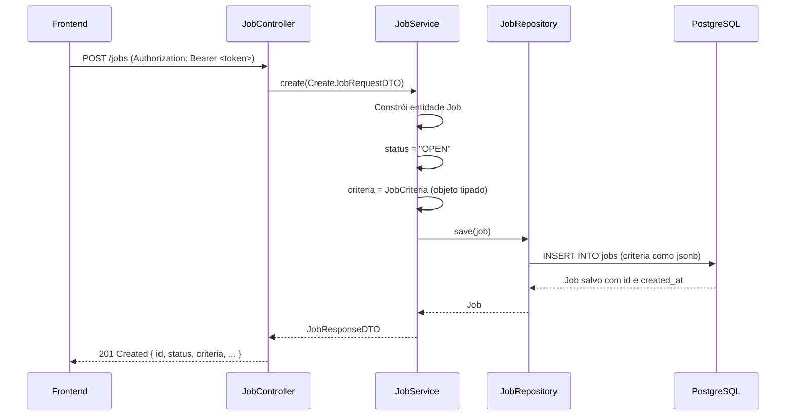

# Vagas (Jobs) — Flowia API

Documentação da feature de gestão de vagas, incluindo criação, consulta, atualização regrada por status e a estrutura de critérios dinâmicos (`JobCriteria`) que alimenta o motor de análise de currículos por IA.

---

## Sumário

- [Visão Geral](#visão-geral)
- [Endpoints](#endpoints)
  - [POST /jobs — Criar vaga](#post-jobs--criar-vaga)
  - [GET /jobs/{id} — Buscar vaga](#get-jobsid--buscar-vaga)
  - [GET /jobs — Listar vagas](#get-jobs--listar-vagas)
  - [PATCH /jobs/{id} — Atualizar vaga](#patch-jobsid--atualizar-vaga)
- [DTOs](#dtos)
- [Modelo de Vaga](#modelo-de-vaga)
- [JobCriteria — Estrutura de Critérios](#jobcriteria--estrutura-de-critérios)
- [Fluxo de Status](#fluxo-de-status)
- [Regras de Atualização](#regras-de-atualização)
- [Tratamento de Erros](#tratamento-de-erros)
- [Exemplos para Teste](#exemplos-para-teste)
- [Decisões de Arquitetura](#decisões-de-arquitetura)

---

## Visão Geral

A feature de vagas permite que recrutadores cadastrem oportunidades com suas informações públicas (título, descrição, localização, salário) e um objeto `criteria` que configura o motor de análise da IA. Esse objeto é armazenado como `jsonb` no PostgreSQL, garantindo flexibilidade sem necessidade de migrations a cada evolução dos critérios.

Os endpoints **não executam score nem lógica de IA** — apenas persistem a configuração da vaga para que o **n8n** e os **agentes de IA** consumam os critérios durante a análise dos currículos.

Quando `criteria` é atualizado, o campo `criteriaUpdatedAt` é preenchido automaticamente pela API, sinalizando ao n8n que as análises anteriores dos candidatos estão desatualizadas e precisam de reprocessamento.

---

## Endpoints

### POST /jobs — Criar vaga

Cria uma nova vaga com status inicial `OPEN`. O recrutador é vinculado automaticamente via token JWT.

**Acesso:** requer autenticação (`Authorization: Bearer <token>`)

#### Request Body

```json
{
  "title": "Desenvolvedor Backend Pleno",
  "description": "Vaga para desenvolvedor com foco em APIs REST e microsserviços.",
  "companyId": "550e8400-e29b-41d4-a716-446655440000",
  "modality": "REMOTE",
  "salary": "R$ 8.000 - R$ 12.000",
  "city": "São Paulo",
  "state": "SP",
  "criteria": { ... }
}
```

| Campo | Tipo | Validação |
|---|---|---|
| `title` | `string` | Obrigatório |
| `description` | `string` | Obrigatório |
| `companyId` | `string` (UUID) | Obrigatório |
| `modality` | `string` | Obrigatório (`REMOTE`, `HYBRID`, `ON_SITE`) |
| `salary` | `string` | Opcional |
| `city` | `string` | Opcional |
| `state` | `string` | Opcional |
| `criteria` | `JobCriteria` | Obrigatório |

#### Response — `201 Created`

```json
{
  "id": "7f3e4a21-...",
  "recruiterId": "a1b2c3d4-...",
  "companyId": "550e8400-...",
  "title": "Desenvolvedor Backend Pleno",
  "description": "Vaga para desenvolvedor com foco em APIs REST e microsserviços.",
  "salary": "R$ 8.000 - R$ 12.000",
  "modality": "REMOTE",
  "city": "São Paulo",
  "state": "SP",
  "status": "OPEN",
  "criteria": { ... },
  "createdAt": "2026-05-26T12:00:00",
  "criteriaUpdatedAt": null
}
```

---

### GET /jobs/{id} — Buscar vaga

Retorna os dados de uma vaga pelo ID.

**Acesso:** requer autenticação

#### Response — `200 OK`

```json
{
  "id": "7f3e4a21-...",
  "recruiterId": "a1b2c3d4-...",
  "companyId": "550e8400-...",
  "title": "Desenvolvedor Backend Pleno",
  "description": "...",
  "salary": "R$ 8.000 - R$ 12.000",
  "modality": "REMOTE",
  "city": "São Paulo",
  "state": "SP",
  "status": "OPEN",
  "criteria": { ... },
  "createdAt": "2026-05-26T12:00:00",
  "criteriaUpdatedAt": null
}
```

#### Possíveis Erros

| Status | Cenário |
|---|---|
| `404 Not Found` | Vaga não encontrada |

---

### GET /jobs — Listar vagas

Retorna todas as vagas cadastradas.

**Acesso:** requer autenticação

#### Response — `200 OK`

```json
[
  { "id": "...", "status": "OPEN", ... },
  { "id": "...", "status": "CLOSED", ... }
]
```

---

### PATCH /jobs/{id} — Atualizar vaga

Atualização parcial de uma vaga. Apenas os campos enviados no body são alterados — campos omitidos preservam seus valores atuais.

**Acesso:** requer autenticação. Apenas o recrutador que criou a vaga pode atualizá-la.

#### Request Body (todos os campos opcionais)

```json
{
  "title": "Novo título",
  "description": "Nova descrição",
  "modality": "HYBRID",
  "salary": "R$ 10.000",
  "city": "Campinas",
  "state": "SP",
  "status": "CLOSED",
  "criteria": { ... }
}
```

| Campo | Tipo | Observação |
|---|---|---|
| `title` | `string` | Opcional — alteração livre em qualquer status |
| `description` | `string` | Opcional — alteração livre |
| `modality` | `string` | Opcional — **bloqueado** para vagas `CLOSED` |
| `salary` | `string` | Opcional — alteração livre |
| `city` | `string` | Opcional — alteração livre |
| `state` | `string` | Opcional — alteração livre |
| `status` | `JobStatus` | Opcional — segue [fluxo controlado](#fluxo-de-status) |
| `criteria` | `JobCriteria` | Opcional — **bloqueado** para vagas `CLOSED`; valida soma de pesos = 100 |

> **Campos imutáveis:** `id`, `recruiterId`, `companyId`, `createdAt`, `criteriaUpdatedAt` — nunca aceitos pelo body.

#### Response — `200 OK`

Retorna a vaga atualizada com o mesmo schema do `GET /jobs/{id}`. Se `criteria` foi alterado, `criteriaUpdatedAt` virá preenchido com o timestamp da alteração.

---

## DTOs

### `CreateJobRequestDTO`

```
title       — string, @NotBlank
description — string, @NotBlank
companyId   — string, @NotBlank
modality    — string, @NotBlank
salary      — string, opcional
city        — string, opcional
state       — string, opcional
criteria    — JobCriteria, @NotNull
```

### `UpdateJobRequestDTO`

```
title       — string, opcional
description — string, opcional
modality    — string, opcional (bloqueado em CLOSED)
salary      — string, opcional
city        — string, opcional
state       — string, opcional
status      — JobStatus, opcional (segue fluxo controlado)
criteria    — JobCriteria, opcional (bloqueado em CLOSED; valida pesos)
```

### `JobResponseDTO`

```
id                 — string (UUID)
recruiterId        — string (UUID) — ID do recrutador que criou a vaga
companyId          — string (UUID)
title              — string
description        — string
salary             — string (nullable)
modality           — string
city               — string (nullable)
state              — string (nullable)
status             — JobStatus (DRAFT | OPEN | PAUSED | CLOSED)
criteria           — JobCriteria
createdAt          — LocalDateTime
criteriaUpdatedAt  — LocalDateTime (null se criteria nunca foi alterado pós-criação)
```

---

## Modelo de Vaga

Entidade `Job` mapeada para a tabela `jobs`.

| Coluna | Tipo SQL | Java | Observação |
|---|---|---|---|
| `id` | `uuid` | `String` | PK, gerado automaticamente |
| `title` | `varchar(255)` | `String` | `NOT NULL` |
| `description` | `text` | `String` | `NOT NULL` |
| `recruiter_id` | `uuid` | `User` | FK → `users.id`, `NOT NULL` — recrutador que criou |
| `company_id` | `varchar(255)` | `String` | `NOT NULL` |
| `modality` | `varchar(255)` | `String` | `NOT NULL` |
| `salary` | `varchar(255)` | `String` | nullable |
| `city` | `varchar(255)` | `String` | nullable |
| `state` | `varchar(255)` | `String` | nullable |
| `status` | `varchar(255)` | `JobStatus` | `NOT NULL`, `@Enumerated(STRING)` |
| `criteria` | `jsonb` | `JobCriteria` | Serializado pelo Hibernate + Jackson |
| `criteria_updated_at` | `timestamp` | `LocalDateTime` | nullable — sinal de reprocessamento para o n8n |
| `created_at` | `timestamp` | `LocalDateTime` | `@CreationTimestamp`, imutável |

---

## JobCriteria — Estrutura de Critérios

O objeto `criteria` é o coração do motor de análise. Tipado em Java e armazenado como `jsonb` no banco.

### Estrutura

```
JobCriteria
├── required         (RequiredCriteria)
│   ├── skills                  — habilidades obrigatórias
│   ├── activities              — atividades que o candidato deve dominar
│   ├── education               — formações aceitas
│   └── minimumExperienceYears  — experiência mínima em anos
│
├── desired          (DesiredCriteria)
│   ├── courses                 — cursos e certificações desejáveis
│   ├── experiences             — experiências que agregam valor
│   └── differentials           — diferenciais competitivos
│
├── eliminatory      (EliminatoryCriteria)
│   ├── requiredDegree          — exige formação completa?
│   ├── maxDistanceKm           — distância máxima permitida
│   ├── minimumExperienceYears  — experiência mínima eliminatória
│   ├── requiredSchedule        — regime exigido (ex: CLT, PJ)
│   └── mandatorySkills         — skills sem as quais o candidato é eliminado
│
├── weights          (WeightCriteria)
│   ├── activities   — peso no score (ex: 30)
│   ├── experience   — peso no score (ex: 25)
│   ├── education    — peso no score (ex: 20)
│   ├── location     — peso no score (ex: 10)
│   └── stability    — peso no score (ex: 15)
│         ↳ soma obrigatória = 100 (validado pela API no update)
│
└── positive         (PositiveCriteria)
    ├── hasCertifications        — bônus por certificações
    ├── jobStabilityYears        — anos de estabilidade que geram bônus
    └── hasLeadershipExperience  — bônus por experiência em liderança
```

---

## Fluxo de Status

```
DRAFT ──→ OPEN ──→ PAUSED ──→ OPEN
                ↘         ↘
                 CLOSED    CLOSED
```

| De \ Para | `DRAFT` | `OPEN` | `PAUSED` | `CLOSED` |
|---|---|---|---|---|
| `DRAFT` | — | ✅ | ❌ | ❌ |
| `OPEN` | ❌ | — | ✅ | ✅ |
| `PAUSED` | ❌ | ✅ | — | ✅ |
| `CLOSED` | ❌ | ❌ | ❌ | — |

> Vagas `CLOSED` não podem ser reabertas sem validação futura.

---

## Regras de Atualização

| Campo/Ação | `OPEN` | `PAUSED` | `CLOSED` | `DRAFT` |
|---|---|---|---|---|
| `title`, `description`, `salary`, `city`, `state` | ✅ livre | ✅ livre | ✅ livre | ✅ livre |
| `modality` | ✅ | ✅ | ❌ bloqueado | ✅ |
| `criteria` | ✅ + invalida scores | ✅ + invalida scores | ❌ bloqueado | ✅ |
| `status` | → PAUSED / CLOSED | → OPEN / CLOSED | ❌ | → OPEN |

**Quando `criteria` é alterado em vaga não-CLOSED:**
- A soma dos `weights` é validada (deve ser exatamente 100)
- `criteriaUpdatedAt` é preenchido com `LocalDateTime.now()`
- O n8n usa esse campo para detectar análises desatualizadas e reenfileirar o reprocessamento

---

## Tratamento de Erros

| Exceção | Status HTTP | Mensagem |
|---|---|---|
| `JobNotFoundException` | `404 Not Found` | `"Job not found with id: <id>"` |
| `JobOwnershipException` | `403 Forbidden` | `"You do not have permission to modify this job"` |
| `JobStatusTransitionException` | `422 Unprocessable Entity` | `"Invalid status transition from <X> to <Y>"` |
| `InvalidJobCriteriaException` | `400 Bad Request` | Mensagem descritiva (criteria bloqueado, pesos inválidos, modality bloqueado) |
| `InvalidJobStatusException` | `400 Bad Request` | `"Invalid job status: <status>"` |
| `MethodArgumentNotValidException` | `400 Bad Request` | Mapa de campos inválidos |

---

## Exemplos para Teste

> **Pré-requisito:** obtenha um token via `POST /auth/login` e substitua `<TOKEN>` nos exemplos abaixo.
> O `<JOB_ID>` é o `id` retornado no `POST /jobs`.

---

### 1. Criar vaga (`POST /jobs`)

```bash
curl -X POST http://localhost:8080/jobs \
  -H "Content-Type: application/json" \
  -H "Authorization: Bearer <TOKEN>" \
  -d '{
    "title": "Desenvolvedor Backend Pleno",
    "description": "Vaga para desenvolvedor com foco em APIs REST e microsserviços com Spring Boot.",
    "companyId": "550e8400-e29b-41d4-a716-446655440000",
    "modality": "REMOTE",
    "salary": "R$ 8.000 - R$ 12.000",
    "city": "São Paulo",
    "state": "SP",
    "criteria": {
      "required": {
        "skills": ["Java", "Spring Boot", "PostgreSQL"],
        "activities": ["Desenvolver APIs REST", "Revisar código", "Participar de cerimônias ágeis"],
        "education": ["Ciência da Computação", "Engenharia de Software"],
        "minimumExperienceYears": 2
      },
      "desired": {
        "courses": ["AWS Cloud Practitioner", "Docker Essentials"],
        "experiences": ["Trabalho em startups", "Projetos open source"],
        "differentials": ["Inglês intermediário", "Conhecimento em microsserviços"]
      },
      "eliminatory": {
        "requiredDegree": true,
        "maxDistanceKm": 50,
        "minimumExperienceYears": 1,
        "requiredSchedule": "CLT",
        "mandatorySkills": ["Java", "Git"]
      },
      "weights": {
        "activities": 30,
        "experience": 25,
        "education": 20,
        "location": 10,
        "stability": 15
      },
      "positive": {
        "hasCertifications": true,
        "jobStabilityYears": 2,
        "hasLeadershipExperience": false
      }
    }
  }'
```

**Esperado:** `201 Created` com `id`, `recruiterId`, `status: "OPEN"`, `criteriaUpdatedAt: null`

---

### 2. Buscar vaga por ID (`GET /jobs/{id}`)

```bash
curl -X GET http://localhost:8080/jobs/<JOB_ID> \
  -H "Authorization: Bearer <TOKEN>"
```

**Esperado:** `200 OK` com os dados da vaga.

**Erro esperado — ID inexistente:**
```bash
curl -X GET http://localhost:8080/jobs/id-que-nao-existe \
  -H "Authorization: Bearer <TOKEN>"
# → 404 { "error": "Job not found with id: id-que-nao-existe" }
```

---

### 3. Listar todas as vagas (`GET /jobs`)

```bash
curl -X GET http://localhost:8080/jobs \
  -H "Authorization: Bearer <TOKEN>"
```

**Esperado:** `200 OK` com array de vagas.

---

### 4. Atualizar campos públicos (`PATCH /jobs/{id}`)

Alterações em `title`, `salary`, `city`, `state` são livres em qualquer status.

```bash
curl -X PATCH http://localhost:8080/jobs/<JOB_ID> \
  -H "Content-Type: application/json" \
  -H "Authorization: Bearer <TOKEN>" \
  -d '{
    "salary": "R$ 10.000 - R$ 14.000",
    "city": "Campinas"
  }'
```

**Esperado:** `200 OK` — só `salary` e `city` mudam, os demais campos preservados.

---

### 5. Atualizar `criteria` (invalida scores) (`PATCH /jobs/{id}`)

```bash
curl -X PATCH http://localhost:8080/jobs/<JOB_ID> \
  -H "Content-Type: application/json" \
  -H "Authorization: Bearer <TOKEN>" \
  -d '{
    "criteria": {
      "required": {
        "skills": ["Java", "Spring Boot", "Kubernetes"],
        "activities": ["Desenvolver APIs REST", "Arquitetar soluções"],
        "education": ["Ciência da Computação"],
        "minimumExperienceYears": 3
      },
      "desired": {
        "courses": ["CKA", "AWS Solutions Architect"],
        "experiences": ["Projetos de alta escala"],
        "differentials": ["Inglês avançado"]
      },
      "eliminatory": {
        "requiredDegree": true,
        "maxDistanceKm": 100,
        "minimumExperienceYears": 2,
        "requiredSchedule": "PJ",
        "mandatorySkills": ["Java", "Docker"]
      },
      "weights": {
        "activities": 35,
        "experience": 30,
        "education": 15,
        "location": 10,
        "stability": 10
      },
      "positive": {
        "hasCertifications": true,
        "jobStabilityYears": 3,
        "hasLeadershipExperience": true
      }
    }
  }'
```

**Esperado:** `200 OK` com `criteriaUpdatedAt` preenchido com o timestamp atual.

**Erro esperado — pesos não somam 100:**
```bash
# weights: 35 + 30 + 15 + 10 + 5 = 95
curl -X PATCH http://localhost:8080/jobs/<JOB_ID> \
  -H "Content-Type: application/json" \
  -H "Authorization: Bearer <TOKEN>" \
  -d '{
    "criteria": {
      "weights": { "activities": 35, "experience": 30, "education": 15, "location": 10, "stability": 5 }
    }
  }'
# → 400 { "error": "Criteria weights must sum to 100, but got: 95" }
```

---

### 6. Transição de status (`PATCH /jobs/{id}`)

**OPEN → PAUSED:**
```bash
curl -X PATCH http://localhost:8080/jobs/<JOB_ID> \
  -H "Content-Type: application/json" \
  -H "Authorization: Bearer <TOKEN>" \
  -d '{ "status": "PAUSED" }'
```

**PAUSED → OPEN:**
```bash
curl -X PATCH http://localhost:8080/jobs/<JOB_ID> \
  -H "Content-Type: application/json" \
  -H "Authorization: Bearer <TOKEN>" \
  -d '{ "status": "OPEN" }'
```

**OPEN → CLOSED:**
```bash
curl -X PATCH http://localhost:8080/jobs/<JOB_ID> \
  -H "Content-Type: application/json" \
  -H "Authorization: Bearer <TOKEN>" \
  -d '{ "status": "CLOSED" }'
```

**Erro esperado — transição inválida (CLOSED → OPEN):**
```bash
curl -X PATCH http://localhost:8080/jobs/<JOB_ID> \
  -H "Content-Type: application/json" \
  -H "Authorization: Bearer <TOKEN>" \
  -d '{ "status": "OPEN" }'
# → 422 { "error": "Invalid status transition from CLOSED to OPEN" }
```

---

### 7. Erros de autenticação e propriedade

**Sem token:**
```bash
curl -X PATCH http://localhost:8080/jobs/<JOB_ID> \
  -H "Content-Type: application/json" \
  -d '{ "title": "Teste" }'
# → 403 Forbidden
```

**Token de outro recrutador tentando editar a vaga:**
```bash
curl -X PATCH http://localhost:8080/jobs/<JOB_ID> \
  -H "Content-Type: application/json" \
  -H "Authorization: Bearer <TOKEN_DE_OUTRO_USUARIO>" \
  -d '{ "title": "Invasão" }'
# → 403 { "error": "You do not have permission to modify this job" }
```

**Tentativa de alterar `criteria` em vaga CLOSED:**
```bash
curl -X PATCH http://localhost:8080/jobs/<JOB_ID_CLOSED> \
  -H "Content-Type: application/json" \
  -H "Authorization: Bearer <TOKEN>" \
  -d '{ "criteria": { "weights": { "activities": 100, "experience": 0, "education": 0, "location": 0, "stability": 0 } } }'
# → 400 { "error": "Cannot change criteria of a CLOSED job" }
```

---

## Decisões de Arquitetura

### Por que `jsonb` para `criteria`?

- **Flexibilidade**: novos campos no objeto não exigem migrations no banco.
- **Escalabilidade**: o motor de IA pode evoluir seus critérios sem impactar o schema.
- **Consultas nativas**: PostgreSQL permite queries com operadores `->` e `->>`.
- **Tipagem no Java**: Hibernate + Jackson serializa/desserializa automaticamente.

### Por que `criteriaUpdatedAt` em vez de invalidar análises diretamente?

O update da vaga não conhece o estado das análises dos candidatos — isso é responsabilidade do n8n. O campo `criteriaUpdatedAt` funciona como um **contrato assíncrono**: sempre que não for `null`, o n8n sabe que deve comparar o timestamp com as análises existentes e reenfileirar as desatualizadas.

### Por que `@Enumerated(STRING)` no status?

Garante que o valor salvo no banco é a string `"OPEN"`, `"CLOSED"` etc., e não o índice ordinal do enum. Isso torna o banco legível e protege contra bugs ao reordenar valores no enum.

### Separação de responsabilidades

| Camada | Responsabilidade |
|---|---|
| `JobController` | Receber HTTP, extrair `@AuthenticationPrincipal`, delegar ao service |
| `JobService` | Aplicar regras de negócio (ownership, transição, pesos, criteria) |
| `JobRepository` | Acesso ao banco via Spring Data JPA |
| `JobCriteria` | Representar a configuração do motor de IA de forma tipada |
| n8n / Agentes de IA | Consumir `criteria` e `criteriaUpdatedAt` para reprocessar candidaturas |


---

## Sumário

- [Visão Geral](#visão-geral)
- [Endpoints](#endpoints)
  - [POST /jobs](#post-jobs)
- [DTOs](#dtos)
- [Modelo de Vaga](#modelo-de-vaga)
- [JobCriteria — Estrutura de Critérios](#jobcriteria--estrutura-de-critérios)
- [Exemplo completo de payload](#exemplo-completo-de-payload)
- [Fluxo de criação](#fluxo-de-criação)
- [Tratamento de Erros](#tratamento-de-erros)
- [Decisões de Arquitetura](#decisões-de-arquitetura)

---

## Visão Geral

A feature de vagas permite que recrutadores cadastrem oportunidades com suas informações públicas (título, descrição, localização, salário) e um objeto `criteria` que configura o motor de análise da IA. Esse objeto é armazenado como `jsonb` no PostgreSQL, garantindo flexibilidade sem necessidade de migrations a cada evolução dos critérios.

O endpoint **não executa score nem lógica de IA** — ele apenas persiste a configuração da vaga para que o **n8n** e os **agentes de IA** consumam os critérios durante a análise dos currículos.

---

## Endpoints

### POST /jobs

Cria uma nova vaga com status inicial `OPEN`.

**Acesso:** requer autenticação (`Authorization: Bearer <token>`)

#### Request Body

```json
{
  "title": "Desenvolvedor Backend Pleno",
  "description": "Vaga para desenvolvedor com foco em APIs REST e microsserviços.",
  "companyId": "550e8400-e29b-41d4-a716-446655440000",
  "modality": "REMOTE",
  "salary": "R$ 8.000 - R$ 12.000",
  "city": "São Paulo",
  "state": "SP",
  "criteria": { ... }
}
```

| Campo | Tipo | Validação |
|---|---|---|
| `title` | `string` | Obrigatório |
| `description` | `string` | Obrigatório |
| `companyId` | `string` (UUID) | Obrigatório |
| `modality` | `string` | Obrigatório (ex: `REMOTE`, `HYBRID`, `ON_SITE`) |
| `salary` | `string` | Opcional |
| `city` | `string` | Opcional |
| `state` | `string` | Opcional |
| `criteria` | `JobCriteria` | Obrigatório |

#### Response — `201 Created`

```json
{
  "id": "7f3e4a21-...",
  "companyId": "550e8400-...",
  "title": "Desenvolvedor Backend Pleno",
  "description": "Vaga para desenvolvedor com foco em APIs REST e microsserviços.",
  "salary": "R$ 8.000 - R$ 12.000",
  "modality": "REMOTE",
  "city": "São Paulo",
  "state": "SP",
  "status": "OPEN",
  "criteria": { ... },
  "createdAt": "2026-05-26T00:40:00"
}
```

#### Possíveis Erros

| Status | Cenário |
|---|---|
| `400 Bad Request` | Campos obrigatórios ausentes ou `criteria` nulo |
| `401 Unauthorized` | Token ausente ou inválido |
| `404 Not Found` | Vaga não encontrada (futuros endpoints) |

---

## DTOs

### `CreateJobRequestDTO`

```
title       — string, obrigatório
description — string, obrigatório
companyId   — string (UUID), obrigatório
modality    — string, obrigatório
salary      — string, opcional
city        — string, opcional
state       — string, opcional
criteria    — JobCriteria, obrigatório
```

### `JobResponseDTO`

```
id          — string (UUID)
companyId   — string (UUID)
title       — string
description — string
salary      — string
modality    — string
city        — string
state       — string
status      — string (OPEN | CLOSED | PAUSED)
criteria    — JobCriteria
createdAt   — LocalDateTime
```

---

## Modelo de Vaga

Entidade `Job` mapeada para a tabela `jobs`.

| Coluna | Tipo SQL | Java | Observação |
|---|---|---|---|
| `id` | `uuid` | `String` | PK, gerado automaticamente |
| `title` | `varchar(255)` | `String` | `NOT NULL` |
| `description` | `text` | `String` | `NOT NULL` |
| `company_id` | `varchar(255)` | `String` | `NOT NULL` — referência à empresa |
| `modality` | `varchar(255)` | `String` | `NOT NULL` |
| `salary` | `varchar(255)` | `String` | nullable |
| `city` | `varchar(255)` | `String` | nullable |
| `state` | `varchar(255)` | `String` | nullable |
| `status` | `varchar(255)` | `String` | `NOT NULL`, default `OPEN` |
| `criteria` | `jsonb` | `JobCriteria` | Serializado automaticamente pelo Hibernate + Jackson |
| `created_at` | `timestamp` | `LocalDateTime` | Preenchido por `@CreationTimestamp`, imutável |

---

## JobCriteria — Estrutura de Critérios

O objeto `criteria` é o coração do motor de análise. Ele é tipado em Java mas armazenado como `jsonb` no banco, permitindo evolução sem migrations.

### Estrutura

```
JobCriteria
├── required         (RequiredCriteria)
│   ├── skills                  — habilidades obrigatórias
│   ├── activities              — atividades que o candidato deve dominar
│   ├── education               — formações aceitas
│   └── minimumExperienceYears  — experiência mínima em anos
│
├── desired          (DesiredCriteria)
│   ├── courses                 — cursos e certificações desejáveis
│   ├── experiences             — experiências que agregam valor
│   └── differentials           — diferenciais competitivos
│
├── eliminatory      (EliminatoryCriteria)
│   ├── requiredDegree          — exige formação completa?
│   ├── maxDistanceKm           — distância máxima permitida
│   ├── minimumExperienceYears  — experiência mínima eliminatória
│   ├── requiredSchedule        — regime exigido (ex: CLT, PJ)
│   └── mandatorySkills         — skills sem as quais o candidato é eliminado
│
├── weights          (WeightCriteria)
│   ├── activities   — peso das atividades no score (ex: 30)
│   ├── experience   — peso da experiência (ex: 25)
│   ├── education    — peso da formação (ex: 20)
│   ├── location     — peso da localização (ex: 10)
│   └── stability    — peso da estabilidade (ex: 15)
│
└── positive         (PositiveCriteria)
    ├── hasCertifications        — bônus por certificações
    ├── jobStabilityYears        — anos de estabilidade que geram bônus
    └── hasLeadershipExperience  — bônus por experiência em liderança
```

> **Convenção:** a soma dos campos de `weights` deve ser **100**. A validação desse invariante é responsabilidade da IA/n8n, não da API.

---

## Exemplo completo de payload

```json
POST /jobs
Authorization: Bearer <token>

{
  "title": "Desenvolvedor Backend Pleno",
  "description": "Vaga para desenvolvedor com foco em APIs REST e microsserviços com Spring Boot.",
  "companyId": "550e8400-e29b-41d4-a716-446655440000",
  "modality": "REMOTE",
  "salary": "R$ 8.000 - R$ 12.000",
  "city": "São Paulo",
  "state": "SP",
  "criteria": {
    "required": {
      "skills": ["Java", "Spring Boot", "PostgreSQL"],
      "activities": ["Desenvolver APIs REST", "Revisar código", "Participar de cerimônias ágeis"],
      "education": ["Ciência da Computação", "Engenharia de Software", "Sistemas de Informação"],
      "minimumExperienceYears": 2
    },
    "desired": {
      "courses": ["AWS Cloud Practitioner", "Docker Essentials"],
      "experiences": ["Trabalho em startups", "Projetos open source"],
      "differentials": ["Inglês intermediário", "Conhecimento em microsserviços"]
    },
    "eliminatory": {
      "requiredDegree": true,
      "maxDistanceKm": 50,
      "minimumExperienceYears": 1,
      "requiredSchedule": "CLT",
      "mandatorySkills": ["Java", "Git"]
    },
    "weights": {
      "activities": 30,
      "experience": 25,
      "education": 20,
      "location": 10,
      "stability": 15
    },
    "positive": {
      "hasCertifications": true,
      "jobStabilityYears": 2,
      "hasLeadershipExperience": false
    }
  }
}
```

---

## Fluxo de criação



---

## Tratamento de Erros

| Exceção | Status HTTP | Mensagem |
|---|---|---|
| `JobNotFoundException` | `404 Not Found` | `"Job not found with id: <id>"` |
| `InvalidJobStatusException` | `400 Bad Request` | `"Invalid job status: <status>"` |
| `MethodArgumentNotValidException` | `400 Bad Request` | Mapa de campos inválidos |

### Exemplo — campos obrigatórios ausentes (`400`)

```json
{
  "title": "Title is required",
  "criteria": "must not be null"
}
```

### Exemplo — vaga não encontrada (`404`)

```json
{
  "error": "Job not found with id: 7f3e4a21-..."
}
```

---

## Decisões de Arquitetura

### Por que `jsonb` para `criteria`?

Armazenar `JobCriteria` como `jsonb` no PostgreSQL permite:
- **Flexibilidade**: novos campos podem ser adicionados ao objeto sem migrations no banco.
- **Escalabilidade**: o motor de IA pode evoluir seus critérios sem impactar o schema.
- **Consultas nativas**: o PostgreSQL permite queries diretas no jsonb com operadores `->` e `->>`.
- **Tipagem no Java**: o Hibernate + Jackson serializa/desserializa automaticamente entre `JobCriteria` e JSON.

### Por que `status` como `String` e não enum?

O status é definido como `String` para permitir que novos estados (`PAUSED`, `DRAFT`, `ARCHIVED`) sejam adicionados sem alteração de enum e redeployment. A validação de estados válidos é feita pela exceção `InvalidJobStatusException` no service.

### Separação de responsabilidades

| Camada | Responsabilidade |
|---|---|
| `JobController` | Receber requisição HTTP, delegar ao service, retornar resposta |
| `JobService` | Construir a entidade, definir defaults (`status = OPEN`), persistir |
| `JobRepository` | Acesso ao banco via Spring Data JPA |
| `JobCriteria` | Representar a configuração do motor de IA de forma tipada |
| n8n / Agentes de IA | Consumir `criteria` do banco e executar a análise dos currículos |
