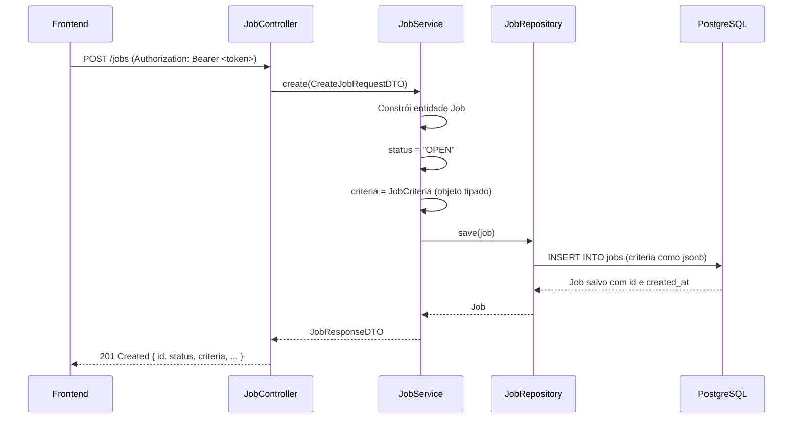

# Vagas (Jobs) — Flowia API

Documentação da feature de criação e gestão de vagas, incluindo a estrutura de critérios dinâmicos (`JobCriteria`) que alimenta o motor de análise de currículos por IA.

---

## Sumário

- [Visão Geral](#visão-geral)
- [Endpoints](#endpoints)
  - [POST /jobs](#post-jobs)
- [DTOs](#dtos)
- [Modelo de Vaga](#modelo-de-vaga)
- [JobCriteria — Estrutura de Critérios](#jobcriteria--estrutura-de-critérios)
- [Exemplo completo de payload](#exemplo-completo-de-payload)
- [Fluxo de criação](#fluxo-de-criação)
- [Tratamento de Erros](#tratamento-de-erros)
- [Decisões de Arquitetura](#decisões-de-arquitetura)

---

## Visão Geral

A feature de vagas permite que recrutadores cadastrem oportunidades com suas informações públicas (título, descrição, localização, salário) e um objeto `criteria` que configura o motor de análise da IA. Esse objeto é armazenado como `jsonb` no PostgreSQL, garantindo flexibilidade sem necessidade de migrations a cada evolução dos critérios.

O endpoint **não executa score nem lógica de IA** — ele apenas persiste a configuração da vaga para que o **n8n** e os **agentes de IA** consumam os critérios durante a análise dos currículos.

---

## Endpoints

### POST /jobs

Cria uma nova vaga com status inicial `OPEN`.

**Acesso:** requer autenticação (`Authorization: Bearer <token>`)

#### Request Body

```json
{
  "title": "Desenvolvedor Backend Pleno",
  "description": "Vaga para desenvolvedor com foco em APIs REST e microsserviços.",
  "companyId": "550e8400-e29b-41d4-a716-446655440000",
  "modality": "REMOTE",
  "salary": "R$ 8.000 - R$ 12.000",
  "city": "São Paulo",
  "state": "SP",
  "criteria": { ... }
}
```

| Campo | Tipo | Validação |
|---|---|---|
| `title` | `string` | Obrigatório |
| `description` | `string` | Obrigatório |
| `companyId` | `string` (UUID) | Obrigatório |
| `modality` | `string` | Obrigatório (ex: `REMOTE`, `HYBRID`, `ON_SITE`) |
| `salary` | `string` | Opcional |
| `city` | `string` | Opcional |
| `state` | `string` | Opcional |
| `criteria` | `JobCriteria` | Obrigatório |

#### Response — `201 Created`

```json
{
  "id": "7f3e4a21-...",
  "companyId": "550e8400-...",
  "title": "Desenvolvedor Backend Pleno",
  "description": "Vaga para desenvolvedor com foco em APIs REST e microsserviços.",
  "salary": "R$ 8.000 - R$ 12.000",
  "modality": "REMOTE",
  "city": "São Paulo",
  "state": "SP",
  "status": "OPEN",
  "criteria": { ... },
  "createdAt": "2026-05-26T00:40:00"
}
```

#### Possíveis Erros

| Status | Cenário |
|---|---|
| `400 Bad Request` | Campos obrigatórios ausentes ou `criteria` nulo |
| `401 Unauthorized` | Token ausente ou inválido |
| `404 Not Found` | Vaga não encontrada (futuros endpoints) |

---

## DTOs

### `CreateJobRequestDTO`

```
title       — string, obrigatório
description — string, obrigatório
companyId   — string (UUID), obrigatório
modality    — string, obrigatório
salary      — string, opcional
city        — string, opcional
state       — string, opcional
criteria    — JobCriteria, obrigatório
```

### `JobResponseDTO`

```
id          — string (UUID)
companyId   — string (UUID)
title       — string
description — string
salary      — string
modality    — string
city        — string
state       — string
status      — string (OPEN | CLOSED | PAUSED)
criteria    — JobCriteria
createdAt   — LocalDateTime
```

---

## Modelo de Vaga

Entidade `Job` mapeada para a tabela `jobs`.

| Coluna | Tipo SQL | Java | Observação |
|---|---|---|---|
| `id` | `uuid` | `String` | PK, gerado automaticamente |
| `title` | `varchar(255)` | `String` | `NOT NULL` |
| `description` | `text` | `String` | `NOT NULL` |
| `company_id` | `varchar(255)` | `String` | `NOT NULL` — referência à empresa |
| `modality` | `varchar(255)` | `String` | `NOT NULL` |
| `salary` | `varchar(255)` | `String` | nullable |
| `city` | `varchar(255)` | `String` | nullable |
| `state` | `varchar(255)` | `String` | nullable |
| `status` | `varchar(255)` | `String` | `NOT NULL`, default `OPEN` |
| `criteria` | `jsonb` | `JobCriteria` | Serializado automaticamente pelo Hibernate + Jackson |
| `created_at` | `timestamp` | `LocalDateTime` | Preenchido por `@CreationTimestamp`, imutável |

---

## JobCriteria — Estrutura de Critérios

O objeto `criteria` é o coração do motor de análise. Ele é tipado em Java mas armazenado como `jsonb` no banco, permitindo evolução sem migrations.

### Estrutura

```
JobCriteria
├── required         (RequiredCriteria)
│   ├── skills                  — habilidades obrigatórias
│   ├── activities              — atividades que o candidato deve dominar
│   ├── education               — formações aceitas
│   └── minimumExperienceYears  — experiência mínima em anos
│
├── desired          (DesiredCriteria)
│   ├── courses                 — cursos e certificações desejáveis
│   ├── experiences             — experiências que agregam valor
│   └── differentials           — diferenciais competitivos
│
├── eliminatory      (EliminatoryCriteria)
│   ├── requiredDegree          — exige formação completa?
│   ├── maxDistanceKm           — distância máxima permitida
│   ├── minimumExperienceYears  — experiência mínima eliminatória
│   ├── requiredSchedule        — regime exigido (ex: CLT, PJ)
│   └── mandatorySkills         — skills sem as quais o candidato é eliminado
│
├── weights          (WeightCriteria)
│   ├── activities   — peso das atividades no score (ex: 30)
│   ├── experience   — peso da experiência (ex: 25)
│   ├── education    — peso da formação (ex: 20)
│   ├── location     — peso da localização (ex: 10)
│   └── stability    — peso da estabilidade (ex: 15)
│
└── positive         (PositiveCriteria)
    ├── hasCertifications        — bônus por certificações
    ├── jobStabilityYears        — anos de estabilidade que geram bônus
    └── hasLeadershipExperience  — bônus por experiência em liderança
```

> **Convenção:** a soma dos campos de `weights` deve ser **100**. A validação desse invariante é responsabilidade da IA/n8n, não da API.

---

## Exemplo completo de payload

```json
POST /jobs
Authorization: Bearer <token>

{
  "title": "Desenvolvedor Backend Pleno",
  "description": "Vaga para desenvolvedor com foco em APIs REST e microsserviços com Spring Boot.",
  "companyId": "550e8400-e29b-41d4-a716-446655440000",
  "modality": "REMOTE",
  "salary": "R$ 8.000 - R$ 12.000",
  "city": "São Paulo",
  "state": "SP",
  "criteria": {
    "required": {
      "skills": ["Java", "Spring Boot", "PostgreSQL"],
      "activities": ["Desenvolver APIs REST", "Revisar código", "Participar de cerimônias ágeis"],
      "education": ["Ciência da Computação", "Engenharia de Software", "Sistemas de Informação"],
      "minimumExperienceYears": 2
    },
    "desired": {
      "courses": ["AWS Cloud Practitioner", "Docker Essentials"],
      "experiences": ["Trabalho em startups", "Projetos open source"],
      "differentials": ["Inglês intermediário", "Conhecimento em microsserviços"]
    },
    "eliminatory": {
      "requiredDegree": true,
      "maxDistanceKm": 50,
      "minimumExperienceYears": 1,
      "requiredSchedule": "CLT",
      "mandatorySkills": ["Java", "Git"]
    },
    "weights": {
      "activities": 30,
      "experience": 25,
      "education": 20,
      "location": 10,
      "stability": 15
    },
    "positive": {
      "hasCertifications": true,
      "jobStabilityYears": 2,
      "hasLeadershipExperience": false
    }
  }
}
```

---

## Fluxo de criação



---

## Tratamento de Erros

| Exceção | Status HTTP | Mensagem |
|---|---|---|
| `JobNotFoundException` | `404 Not Found` | `"Job not found with id: <id>"` |
| `InvalidJobStatusException` | `400 Bad Request` | `"Invalid job status: <status>"` |
| `MethodArgumentNotValidException` | `400 Bad Request` | Mapa de campos inválidos |

### Exemplo — campos obrigatórios ausentes (`400`)

```json
{
  "title": "Title is required",
  "criteria": "must not be null"
}
```

### Exemplo — vaga não encontrada (`404`)

```json
{
  "error": "Job not found with id: 7f3e4a21-..."
}
```

---

## Decisões de Arquitetura

### Por que `jsonb` para `criteria`?

Armazenar `JobCriteria` como `jsonb` no PostgreSQL permite:
- **Flexibilidade**: novos campos podem ser adicionados ao objeto sem migrations no banco.
- **Escalabilidade**: o motor de IA pode evoluir seus critérios sem impactar o schema.
- **Consultas nativas**: o PostgreSQL permite queries diretas no jsonb com operadores `->` e `->>`.
- **Tipagem no Java**: o Hibernate + Jackson serializa/desserializa automaticamente entre `JobCriteria` e JSON.

### Por que `status` como `String` e não enum?

O status é definido como `String` para permitir que novos estados (`PAUSED`, `DRAFT`, `ARCHIVED`) sejam adicionados sem alteração de enum e redeployment. A validação de estados válidos é feita pela exceção `InvalidJobStatusException` no service.

### Separação de responsabilidades

| Camada | Responsabilidade |
|---|---|
| `JobController` | Receber requisição HTTP, delegar ao service, retornar resposta |
| `JobService` | Construir a entidade, definir defaults (`status = OPEN`), persistir |
| `JobRepository` | Acesso ao banco via Spring Data JPA |
| `JobCriteria` | Representar a configuração do motor de IA de forma tipada |
| n8n / Agentes de IA | Consumir `criteria` do banco e executar a análise dos currículos |
